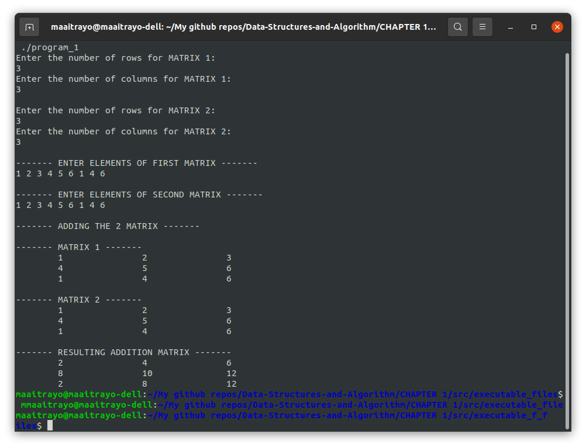

# ARRAYS & STRINGS

## Program Description:
###	ARRAYS
		├── 1. program_1.c -- Addition of two Matrices
		├── 2. program_2.c -- Subtraction of two Matrices
		├── 3. program_3.c -- Find out the sum of each row and column of a Matrix
		├── 4. program_4.c -- Find out the sum of each diagonal elements of a Matrix
		├── 5. program_5.c -- Find out the transpose of a Matrix
		└── 6. program_6.c -- Find out the multiplication of two Matrix

##  Array Program Outputs:
